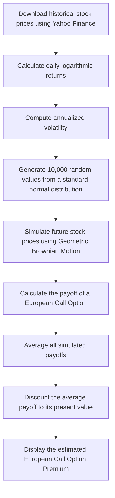

# Monte Carlo Simulation for European Call Option Pricing

**Overview**
This project uses the Monte Carlo simulation technique to estimate the fair price of a European call option with the help of Geometric Brownian Motion (GBM).
Overall, this project shows how probability, statistics, and random simulation can be combined to solve real-world problems in financial markets, especially in option pricing.

##Workflow

## What are Options?
An option is a financial contract that gives the buyer the right, but not the obligation, to buy or sell an asset at a predetermined price before or on a specified date.
It is a type of derivative.

## Decoding symbols
| Symbol | Meaning |
|---------|----------|
| **S0** | Current stock price |
| **ST** | Simulated future stock price |
| **r** | Risk-free interest rate |
| **sigma** | Annualized volatility |
| **T** | Time to expiry |
| **Z** | Random variable |

##References
- Zerodha Varsity modules
- investopedia
- Yahoo Finance API (yFinance)
